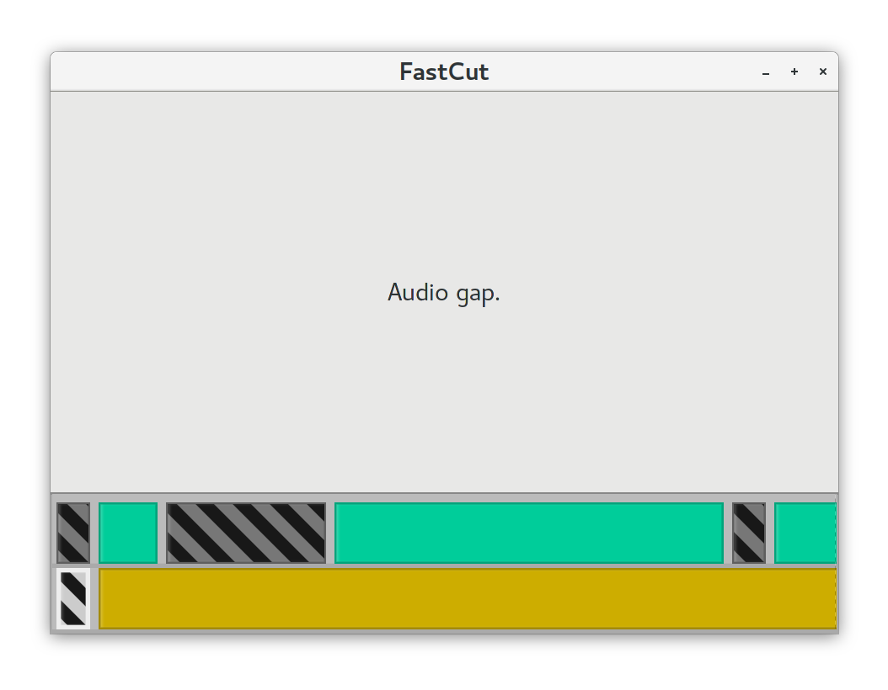
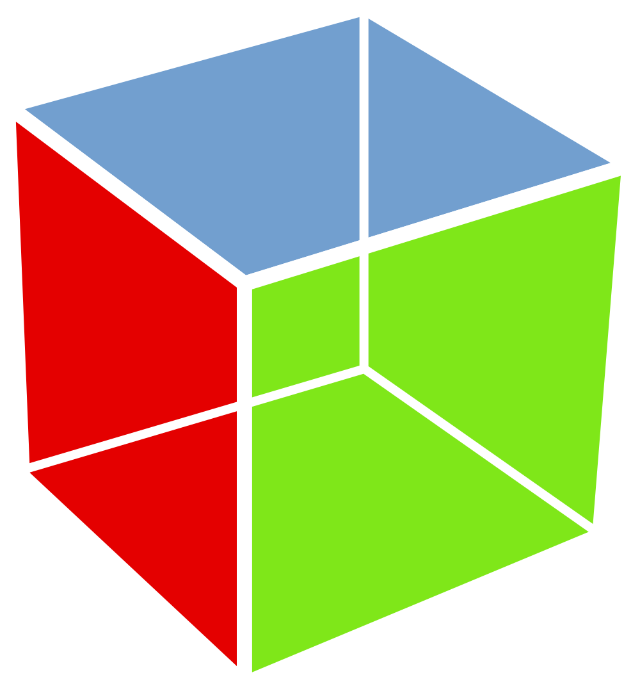

## My Project: FastCut


<table>
  <tr>
    <td>
* Video editor specialized for screencasts
* Written in GHC Haskell
* Desktop GUI application
* Goals
    - Minimal, do one thing really well
    - Core application logic should be pure
    - Portable
    - Reasonably snappy
    - Open source once documented and more useful
    </td>
    <td width="45%">

    </td>
  </tr>
</table>

<aside class="notes">
The project got me looking into GTK+ and Haskell is FastCut, ...
</aside>

## Desktop GUI Frameworks and Haskell

* Imperative
    - GTK+
    - Qt
    - wxWidgets
    - FLTK
* Declarative
    - Reflex
    - Threepenny-gui
    - (Custom WebKit with PureScript or Elm)

<aside class="notes">
When starting the FastCut project, I looked into different desktop GUI frameworks...

End: "I eventually chose GTK for FastCut."
</aside>

## GTK+

<table>
  <tr>
    <td>
* Idiomatic GTK+ Programming
    - Create widgets imperatively
    - Set attributes
    - Attach handers (callbacks) to signals
* GTK+ Builder and Glade
    - XML markup
    - WYSIWYG editor
    - Declarative for first render, then imperative
* CSS support (limited)
* GObject Introspection
    </td>
    <td width="30%" valign="top">

    </td>
  </tr>
</table>

<aside class="notes">
When looking at GTK source code and examples, I've found that idiomatic GTK ...
</aside>

# Haskell and GTK+

## Haskell GTK+ Bindings

* gtk2hs
  - Deprecated in favour of haskell-gi
* haskell-gi
  - Mostly generated using GObject introspection
  - `OverloadedLabels` for methods, attributes, and signals
  - Includes many packages
  - gi-gtk is the library I'll focus on today

## "Hello, world!" with gi-gtk

``` {.haskell include=src/examples/src/Imperative/Hello.hs snippet=main}
```

<aside class="notes">
This is "Hello, world" in haskell-gi
(explain code)
</aside>

# "Hello, world!" {.demo}

# Slightly Larger Example

## An Editable List of Names

``` {.haskell include=src/examples/src/Imperative/Callbacks.hs snippet=editableNamesList-signature}
```

<aside class="notes">
* Let's say we are going define `editableNameList` with this type
* It should be a reusable component
* It could look like this: ...
</aside>

## Modifying State in a Callback {.fragile}

``` {.haskell include=src/examples/src/Imperative/Callbacks.hs snippet=editableNamesList}
```

## Using the Editable List

```haskell
main = do
  ...
```

``` {.haskell include=src/examples/src/Imperative/Callbacks.hs snippet=main}
```

<aside class="notes">
* To use the editable names list, ...
* BUT, there's a big problem here. We don't get notified of modifications.
* So let's fix that...
</aside>


## An Editable List of Names with Updates

``` {.haskell include=src/examples/src/Imperative/Chans.hs snippet=editableNamesList-signature}
```

<aside class="notes">
* Instead of mutating IORefs, we will publish updates...
</aside>


## Sending State Updates on a Channel {.fragile}

``` {.haskell include=src/examples/src/Imperative/Chans.hs snippet=editableNamesList emphasize=2-3,10-13}
```

## Printing Updates

```haskell
main = do
  ...
```

``` {.haskell include=src/examples/src/Imperative/Chans.hs snippet=main}
```

## Callback Problems

* When the application grows, callbacks gets unwieldy
  - `IORef`s, scattered state and logic
  - Side effects
  - Impractical to test
  - Two phases: first construction, subsequent updates
* GUI code should be:
  - A separate concern
  - Declarative
  - Concise
* Core application logic should be:
  - Pure (ideally!)
  - Decoupled from GUI code

# Going Declarative

## Declarative GTK+

* Declarative markup, pure functions from state to markup
* Declarative event handling, not concurrency primitives
* "Virtual DOM" patching
* Not tied to any particular architecture

## gi-gtk-declarative

* [github.com/owickstrom/gi-gtk-declarative](https://github.com/owickstrom/gi-gtk-declarative)
* Very thin layer on top of `gi-gtk`
    - Uses `OverloadedLabels` and type-level goodies
    - Automatic support for declarative and patchable GTK+ widgets
    - Monadic markup builder for do-notation
* Soon on a Hackage near you

<aside class="notes">
* END: Let's look at how you can write markup using this library.
</aside>

## Single Widgets

* Single widgets (without children) are constructed using `widget`:

    ``` {.haskell include=src/examples/src/Declarative/Widgets.hs snippet=widget-no-attrs dedent=2}
    ```

    ``` {.haskell include=src/examples/src/Declarative/Widgets.hs snippet=widget-no-attrs-2 dedent=2}
    ```

## Bins

* In GTK+, a _bin_ can only contain a single child widget

    ``` {.haskell include=src/examples/src/Declarative/Containers.hs snippet=scrolled-window dedent=2}
    ```

* Other examples are:
    - `Expander`
    - `Viewport`
    - `SearchBar`

* To embed many widgets in a bin, use an in-between *container*

## Containers

* Containers can contain zero or more child widgets
* In this library, containers restrict the type of their children:

    - `ListBox` requires each child to be a `ListBoxRow`:

        ``` {.haskell include=src/examples/src/Declarative/Containers.hs snippet=list-box dedent=2}
        ```

    - `Box` requires each child to be a `BoxChild`:

        ``` {.haskell include=src/examples/src/Declarative/Containers.hs snippet=box dedent=2}
        ```

## Attributes

* Widget attributes:

    ``` {.haskell include=src/examples/src/Declarative/Attributes.hs snippet=attributes-widget dedent=2}
    ```

* Bin attributes:

    ``` {.haskell include=src/examples/src/Declarative/Attributes.hs snippet=attributes-bin dedent=2}
    ```

* Container attributes:

    ``` {.haskell include=src/examples/src/Declarative/Attributes.hs snippet=attributes-container dedent=2}
    ```


## Events {.fragile}

* Using `on`, you can emit events:

    ``` {.haskell include=src/examples/src/Declarative/Events/On.hs snippet=on emphasize=8:9-8:33}
    ```

## Events using IO {.fragile}

* Some events need to be constructed in IO, to query widgets for attributes

    ```{.haskell emphasize=3:6-3:25}
    onM                          -- very simplified
      :: Gtk.SignalProxy widget
      -> (widget -> IO event)
      -> Attribute widget event
    ```
* Example emitting events with chosen color:

    ``` {.haskell include=src/examples/src/Declarative/Events/OnM.hs snippet=onM emphasize=6:19-6:58}
    ```

## Functors {.fragile}

* Markup, Widget, Bin, and Container all have `Functor` instances
* We can map other events to our application's event type:

    ``` {.haskell include=src/examples/src/Declarative/Functor.hs snippet=button}
    ```

    ``` {.haskell include=src/examples/src/Declarative/Functor.hs snippet=fmap emphasize=3:20-3:33,6:28-6:52,7:28-7:52}
    ```

## CSS Classes {.fragile}

* CSS classes are added using `classes`:

    ``` {.haskell include=src/examples/src/Declarative/Widgets.hs snippet=widget-classes emphasize=1:18-1:39}
    ```

<aside class="notes">
* Finally there is support for CSS classes
* What you've seen is the declarative markup library
* I've also been working on a simple framework called ...
</aside>

# GI.Gtk.Declarative.App.Simple

## GI.Gtk.Declarative.App.Simple

* State reducer
* Inspired by PureScript's Pux framework
* Also comparable to earlier versions of *The Elm Architecture*

## App

```haskell
data App model event =
  App
    { update :: model -> event -> (model, IO (Maybe event))
    , view   :: model -> Widget event
    , inputs :: [Producer event IO ()]
    }
```

## Running

```haskell
run
  :: Typeable event
  => Text                 -- ^ Window title
  -> Maybe (Int32, Int32) -- ^ Optional window size
  -> App model event      -- ^ Application
  -> model                -- ^ Initial model
  -> IO ()
```

# Revisiting "Hello, world!"

## Imperative Style "Hello, world!"

``` {.haskell include=src/examples/src/Imperative/Hello.hs snippet=main}
```

## Model and Events

``` {.haskell include=src/examples/src/Declarative/Hello.hs snippet=model-event}
```

## View

``` {.haskell include=src/examples/src/Declarative/Hello.hs snippet=view}
```

## Update

``` {.haskell include=src/examples/src/Declarative/Hello.hs snippet=update}
```

## Run

``` {.haskell include=src/examples/src/Declarative/Hello.hs snippet=main}
```

# Revisiting Editable Names

## Editable List of Names, Imperative Style

``` {.haskell include=src/examples/src/Imperative/Chans.hs snippet=editableNamesList}
```

## Model and Events

``` {.haskell include=src/examples/src/Declarative/EditableNames.hs snippet=model-event}
```

## View

``` {.haskell include=src/examples/src/Declarative/EditableNames.hs snippet=view}
```

## Update

``` {.haskell include=src/examples/src/Declarative/EditableNames.hs snippet=update}
```

## Run

``` {.haskell include=src/examples/src/Declarative/EditableNames.hs snippet=main}
```

# Implementation

## Patchable

```haskell
class Patchable widget where
  create :: widget e -> IO Gtk.Widget
  patch :: widget e1 -> widget e2 -> Patch

data Patch
  = Modify (Gtk.Widget -> IO ())
  | Replace (IO Gtk.Widget)
  | Keep
```

## Heterogeneous Widgets

* Widgets are wrapped in the dynamic `Widget` data structure:

    ```haskell
    data Widget event where
      Widget
        :: ( Typeable widget
           , Patchable widget
           , Functor widget
           , EventSource widget
           )
        => widget event
        -> Widget event
    ```

* Similar to `Data.Dynamic`

## Patching Widgets{.fragile}

```{.haskell emphasize=3:18-3:28,3:41-3:51,4:10-4:20}
instance Patchable Widget where
  create (Widget w) = create w
  patch (Widget (w1 :: t1 e1)) (Widget (w2 :: t2 e2)) =
    case eqT @t1 @t2 of
      Just Refl -> patch w1 w2
      _         -> Replace (create w2)
```

* "The class Typeable allows a concrete representation of a type to be
  calculated."

## Smart Constructors Returning Widgets

* All smart constructors can return `Widget` values:

    ```haskell
    widget Button [] :: Widget event

    bin ScrolledWindow [] _ :: Widget event

    container ScrolledWindow [] _ :: Widget event
    ```

## Smart Constructors Returning Markup{.fragile}

* They can also return specialized markup:

    ```{.haskell emphasize=1:20-1:60,9:5-9:38}
    textRow :: Text -> MarkupOf (Bin ListBoxRow Widget) Event ()
    textRow t =
      bin ListBoxRow [] $
        widget Label [ #label := t ]

    myList :: Widget Event
    myList =
      container ListBox [] $
        mapM textRow ["Foo", "Bar", "Baz"]
    ```

# Experience Report from FastCut

## GTK+ in FastCut

* First try was imperative, got stuck directly
* `gi-gtk-declarative` let me build with pure functions:
    - Complex timeline navigation
    - Timeline commands (insert, delete, etc)
* Dropping down to imperative:
    - Custom window setup
    - CSS style contexts
    - Top-level key event listeners
    - Dialogs and prompts
    - Custom application architecture (indexed monad FSM)

## Timeline View

```haskell
timelineView :: Project -> Focus ft -> Widget (Event TimelineMode)
timelineView project focus =
  container Box [#orientation := OrientationVertical] $ do
    boxChild True True 0 $
      renderPreviewPane (firstCompositionPart focus (project ^. timeline))
    boxChild False False 0 $ container
      ScrolledWindow
      [ #hscrollbarPolicy := PolicyTypeAutomatic
      , #vscrollbarPolicy := PolicyTypeNever
      , classes ["timeline-container"]
      ]
      (renderComposition (applyFocus (project ^. timeline) focus))
```

## Property-Based Testing in FastCut

* Timeline navigation, insertion, and deletion; all pure functions
* Property-based testing
    - Hedgehog
    - Generating 10000 sequences of commands
    - Each generated command is based on previous resulting state
    - Each sequence must end with a valid timeline and focus
    - Caught many bugs and corner cases I hadn't thought of

# Summary

## Summary

* Callback-centric GUI programming is hard
* Use pure functions and data structures for your core application code
* Make rendering a function `Model -> Widget`
* GTK+ can be programmed in a declarative fashion using `gi-gtk-declarative`
    - Still experimental
    - I haven't built anything large using `App.Simple`
    - I have done zero benchmarking
* FastCut has been a joy to build in this style

## Thank You!

* Slides: [owickstrom.github.io/declarative-gtk-programming-in-haskell/](https://owickstrom.github.io/declarative-gtk-programming-in-haskell/)
* Code examples and slides source code: [github.com/owickstrom/declarative-gtk-programming-in-haskell/](https://github.com/owickstrom/declarative-gtk-programming-in-haskell/)
